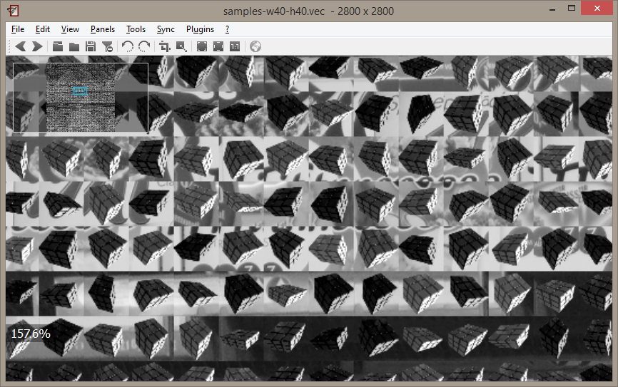

+++
title = "2.0.2 supports .vec file"
date = 2014-07-31T15:10:05+02:00
updated = 2014-07-31T15:10:05+02:00
draft = false
template = "blog/page.html"

[taxonomies]
authors = ["Stefan Fiel"]
+++

In 2.0.2 (we just noticed that we are now the half of not found :)
a new feature was introduced which is very useful for us
and we think it may be useful for those of you who also work in the computer vision field.
We are now able to load the .vec file of the OpenCV Cascade Classifier.
So you can easily control if the patches you trained,
or the patches [OpenCV](https://opencv.org/) created automatically are correct.
Of course we have not added the .vec extension to the default settings of nomacs, because there exists a lot of other vec files.
Thus, you have to add the extension to nomacs manually.
You can do this by opening the “File” -> “Add Image Format”  dialog.
Then you can drag&drop your file into the dialog or use the browse to the file.

After clicking add you have to name the new file format.
After that you can open your .vec files with nomacs.

Due to some limitations of the fileformat nomacs assumes that the patches are square
and thus if you open a file containing non-square nomacs is unable to load it.
If you want to use non-square patches you have to specify the size in the file name.
You can do this by adding “-w\[width\]-h\[height\]”.
So for example you have to name your file “samples-w35-h25.vec”.
Have fun with this feature and may it simplify your training step
— the nomacs team
