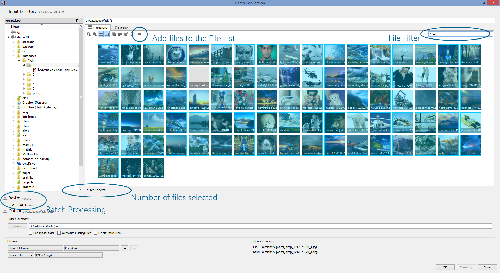
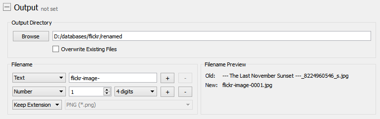

+++
title = "Batch Processing"
date = 2015-03-21T13:06:41+01:00
updated = 2015-03-21T13:06:41+01:00
draft = false
template = "blog/page.html"

[taxonomies]
authors = ["Markus Diem"]
+++

nomacs supports batch processing since version 2.4.
You can open the bach processing from the Menu > Tools > Batch Processing.
Currently there are four different processing modes (Copy/Rename \| Image Format Conversion \| Image Resize \| Transforming).

First you can choose the directory and select the files you want to process.
File selection is similar to the thumbnail preview
(select multiple files using CTRL, hold SHIFT to select files consecutively or hit CTRL+A to select all files of a folder).
You can additionally filter a subset using search terms or regular expressions
(in the example below all files are chosen which start with a lower case character).
After selecting the files to be processed you can click the *Icon Add Files to the File List*.
If you open the *File List* Tab, you can also drop multiple folders to select their files for processing.
Having selected the files to be processed, you can choose an output directory.
The output panel allows you to choose the old filename or rename all processed files.
The screenshot shows a file conversion where 87 files are converted to png.

## Copy/Rename

The Output panel allows you to choose an output directory and rename/convert files.
You can choose a custom filename.
Do not forget to add a sequence number such that the filenames are still unique.
The filename preview picks a selected image and shows the old and the new filename accordingly.
If input and output directory are the same, images will be renamed in place.
Otherwise the images are copied and renamed. This action will not change the image encoding.

<figure>
  
  <figcaption><em>the output panel</em></figcaption>
</figure>

## Image Conversion

If you want to convert images to a specific output format (e.g. PNG) you can change the *Keep Extension* drop down to *Convert To*.
Then select your preferred format.
You can choose any format which is supported by nomacs.
<figure>
  
  <figcaption><em>batch convert images</em></figcaption>
</figure>

## Resize/Transform

Click the + next to *Resize/Transform* to apply an image transform.
If you e.g. want to downsample all images of a folder, you can choose *Long Side* in the resize panel.
Then enter the desired side length in pixel.
This option will resize the image such that the width of panorama images
or the height of portrait images will be set to the desired pixel length.
If you check *Shrink Only* images which have a lower long side than the desired length will not be resized.
<figure>
  
  <figcaption><em>batch resize</em></figcaption>
</figure>

The *Transform* panel allows you to rotate or flip all images.
The gray text next to the panel title indicates if a panel is active or not.
The example below shows a configuration which resizes all images by 50% and then rotates them by 180°.
<figure>
  
  <figcaption><em>batch transform</em></figcaption>
</figure>

## Processing

After you configured the batch processing according to your needs you can hit OK.
A progress bar will appear which indicates the percentage of images already processed.
If you notice a wrong configuration, you can cancel the processing.
All images processed will stay the same then but the processing is stopped immediately.
<figure>
  
  <figcaption><em>processing images</em></figcaption>
</figure>

All processing actions are logged.
Choose *Show Log* to see the status of the processing.
You can see the status of every batch module and check if it was processed successfully.
Please check the batch configuration before Processing especially
if you check *Overwrite Existing* files since these actions cannot be reverted.
<figure>
  
  <figcaption><em>log file</em></figcaption>
</figure>
