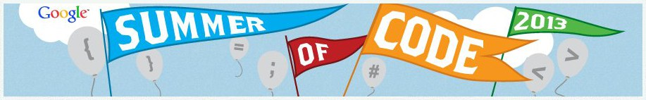

+++
title = "Google Summer of Code 2013"
date = 2013-03-15T14:50:46+01:00
updated = 2013-03-15T14:50:46+01:00
draft = false
template = "blog/page.html"

[taxonomies]
authors = ["Markus Diem"]
+++

we are again applying for Google Summer of Code together with the
[Computational Science and Engineering at Vienna UT](http://www.iue.tuwien.ac.at/cse/index.php/gsoc/2013.html).
If you are a student and want to earn money while supporting nomacs, you can check out our [Ideas Page](/blog/gsoc-2013).
— the nomacs team
