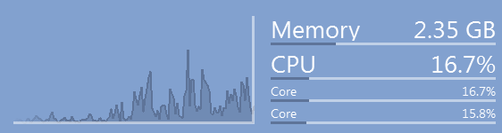

+++
title = "Herbie – Diagnostics"
date = 2012-10-05T19:02:09+02:00
updated = 2012-10-05T19:02:09+02:00
draft = false
template = "blog/page.html"

[taxonomies]
authors = ["Markus Diem"]
+++

We recently updated Herbie – CPU Diagnostics,
which is a CPU monitoring widget that perfectly integrates with your desktop (even if you use multiple).
You can download the (Windows) [installer](https://github.com/diemmarkus/Herbie/releases/download/0.2/herbie-setup.exe)
from [github](https://github.com/diemmarkus/Herbie/releases/).

