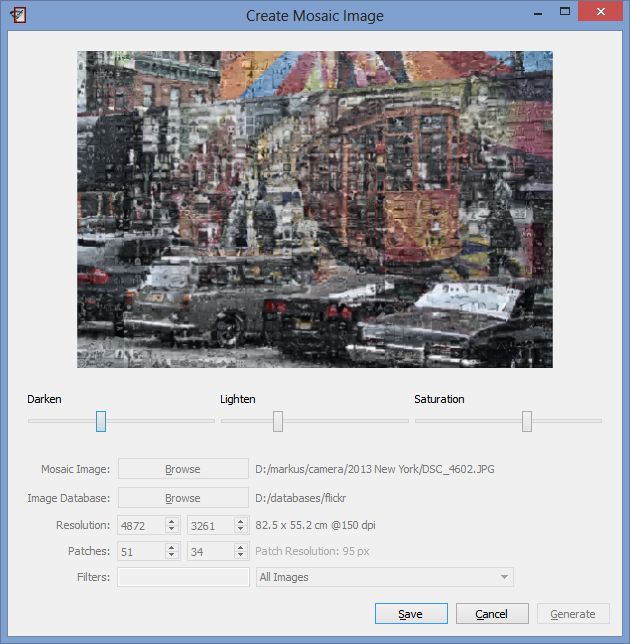
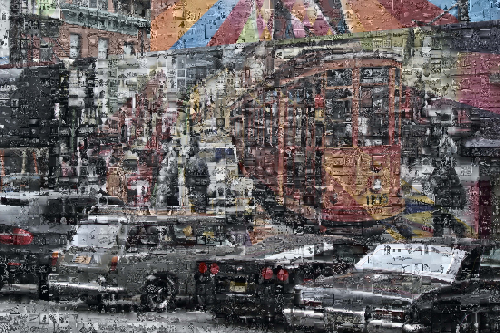

+++
title = "How to create a Mosaic Image"
date = 2014-11-17T16:42:49+01:00
updated = 2014-11-17T16:42:49+01:00
draft = false
template = "blog/page.html"

[taxonomies]
authors = ["Stefan Fiel"]
+++

With nomacs you can easily cerate a Mosaic image.
The tool (Tools > Mosaic Image) allows to create images that are composed of other images.
For detailed instruction, see the screenshots below

<figure>
  
  <figcaption><em>create a mosaic image</em></figcaption>
</figure>

<figure>
  
  <figcaption><em>mosaic image</em></figcaption>
</figure>

