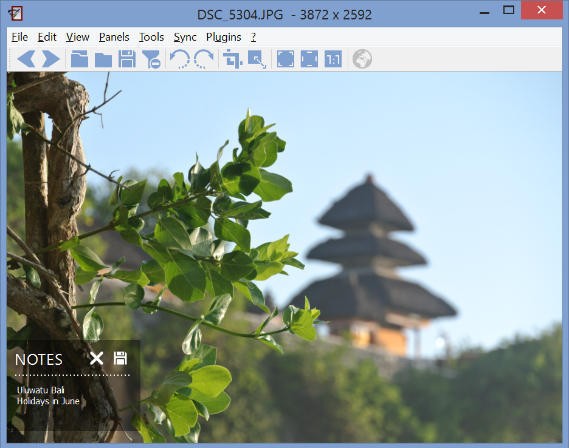

+++
title = "Image Notes"
date = 2014-11-13T21:16:56+01:00
updated = 2014-11-13T21:16:56+01:00
draft = false
template = "blog/page.html"

[taxonomies]
authors = ["Markus Diem"]
+++

<figure>
  
  <figcaption><em>image notes</em></figcaption>
</figure>

We have recently added a new feature called image notes.
A transparent widget appears in the bottom left corner if you click **Panels > Image Notes**
which displays text stored in the image metadata (Exif.Image.ImageDescription).
Thus, other software such as Photoshop can read these notes.
To add or edit notes, simply click into the widget and start typing.
