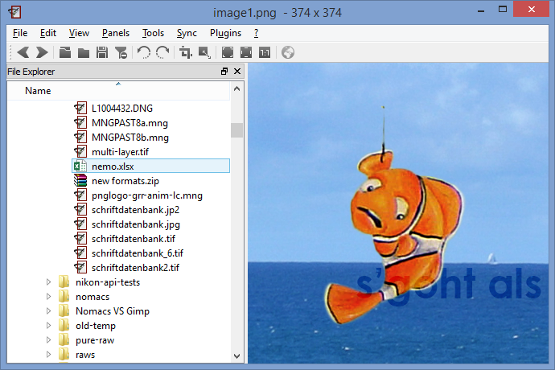

+++
title = "Nomacs & Archives"
date = 2014-11-11T14:38:22+01:00
updated = 2014-11-11T14:38:22+01:00
draft = false
template = "blog/page.html"

[taxonomies]
authors = ["Markus Diem"]
+++

nomacs supports zipped archives since version 2.2.
Hence you can simply drop a zip archive to nomacs and then browse all images in the archive.
Fair enough, but the really cool feature,
is that you can browse through all images of Microsoft Office documents by simply dropping the files to nomacs.
In addition, we have added a tool (Tools > Extract From Archive) which allows to extract all images from Archives to a folder.

## Browsing ZIP Archives with nomacs

## Browsing images in a Microsoft Excel file

## Extracting all images from an Archive

## Dialog for extracting all images from an Archive

