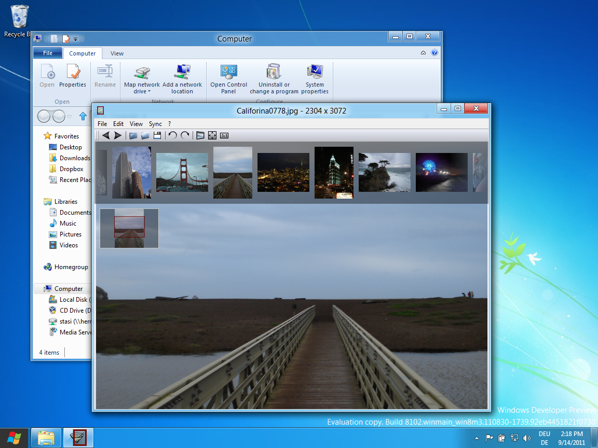

+++
title = "nomacs installed on windows 8"
date = 2011-09-14T15:33:25+02:00
updated = 2011-09-14T15:33:25+02:00
draft = false
template = "blog/page.html"

[taxonomies]
authors = ["Markus Diem"]
+++

we’ve just tested nomacs on windows 8 – 64bit (see screenshots)
works perfectly : )

