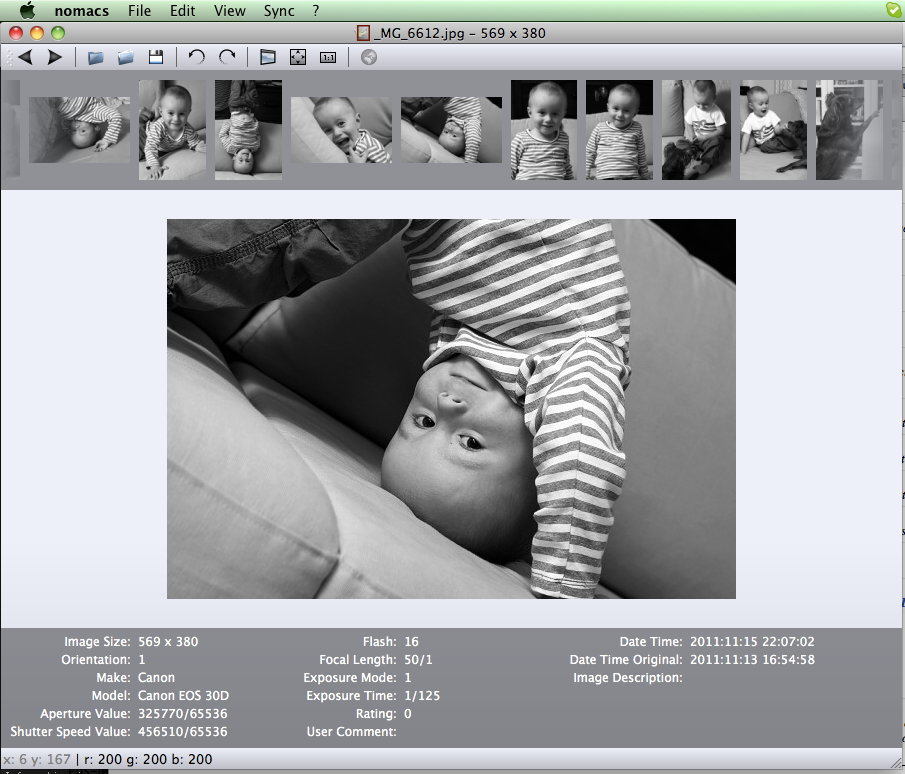

+++
title = "nomacs on macs"
date = 2011-11-17T10:35:49+01:00
updated = 2011-11-17T10:35:49+01:00
draft = false
template = "blog/page.html"

[taxonomies]
authors = ["Markus Diem"]
+++

you won’t believe it, Petr Vanek compiled nomacs on a mac :)
thanks!
