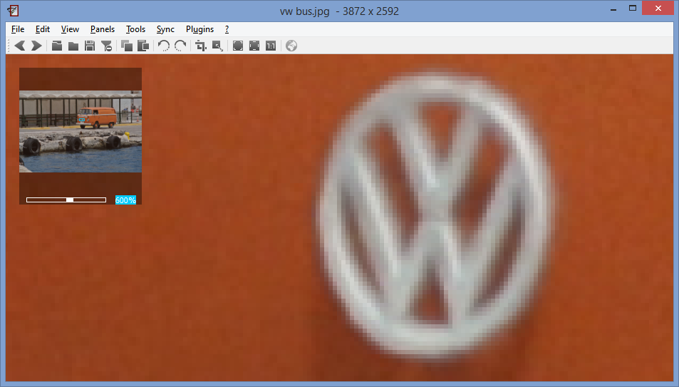

+++
title = "Overview Panel (Zooming)"
date = 2015-03-16T17:15:48+01:00
updated = 2015-03-16T17:15:48+01:00
draft = false
template = "blog/page.html"

[taxonomies]
authors = ["Markus Diem"]
+++

The Overview Panel (Menu > Panels > Overview) enhances zoom and pan.
The blue rectangle shows the current viewing area.
You can pan to a specific location by dragging this rectangle to the desired position.
The scrollbar at the bottom allows you to zoom.
If you want to zoom to a desired factor (e.g. 600 %) you can mark and replace the text accordingly.
<figure>
  
  <figcaption><em>Overview Panel</em></figcaption>
</figure>
