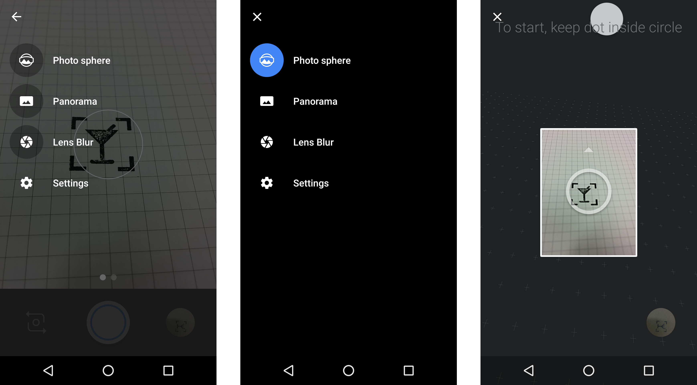

+++
title = "Tiny Planet"
date = 2015-12-17T17:11:49+01:00
updated = 2015-12-17T17:11:49+01:00
draft = false
template = "blog/page.html"

[taxonomies]
authors = ["Markus Diem"]
+++

nomacs can turn your photo spheres into Tiny Planets.
Therefore, you first need to capture a photo sphere.
Here is how you do this in your camera app on Android:

In nomacs you can choose Edit > Tiny Planet to turn your favorite photo sphere into a tiny planet.

In the Tiny Planet dialog, you can adjust the planet’s size and orientation. And here is how the result looks:

