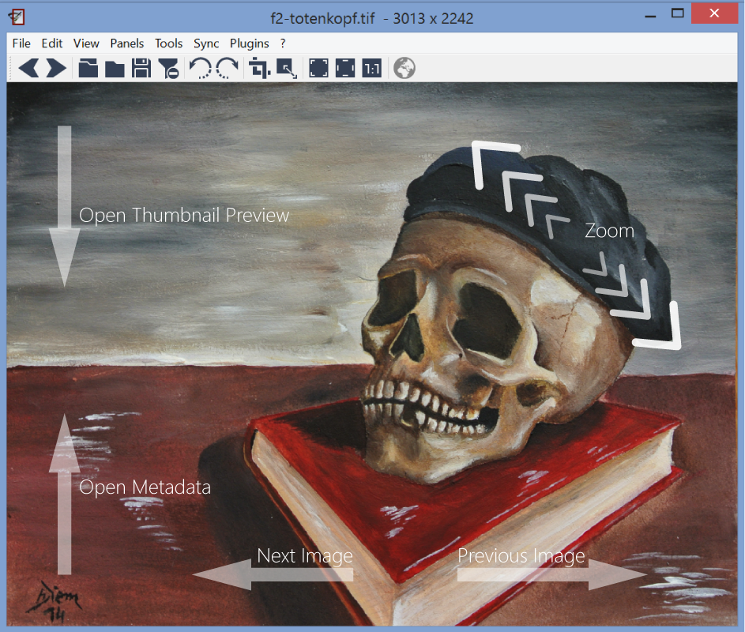

+++
title = "Touch & Gesture Support"
date = 2014-11-12T22:45:54+01:00
updated = 2014-11-12T22:45:54+01:00
draft = false
template = "blog/page.html"

[taxonomies]
authors = ["Markus Diem"]
+++

The touch support was extended in nomacs 2.2.
The illustration below shows the most important gestures.
Horizontal swipes move to the previous/next image if the image fits into the window (otherwise, these gestures are used for panning).
Swiping down from the top opens the thumbnail panel while an upward swipe from the bottom displays the metadata.
Plus you can zoom using pinch gestures.

<figure>
  
  <figcaption><em>mouse and touch gestures</em></figcaption>
</figure>
