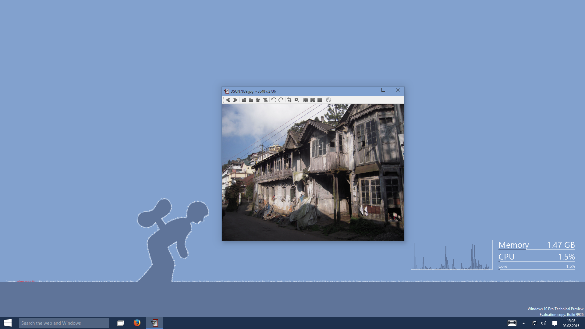

+++
title = "Windows 10"
date = 2015-02-03T15:12:59+01:00
updated = 2015-02-03T15:12:59+01:00
draft = false
template = "blog/page.html"

[taxonomies]
authors = ["Markus Diem"]
+++

We have tested nomacs on windows 10.
Everything works out as expected,
except that the *Frameless View* seems to be obsolete since Microsoft removed the window frames.
— the nomacs team

<figure>
  
  <figcaption><em>nomacs running on windows 10</em></figcaption>
</figure>
